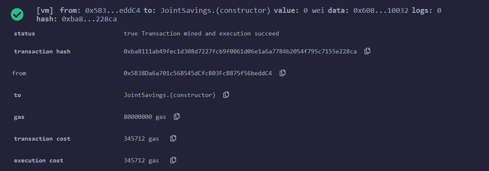
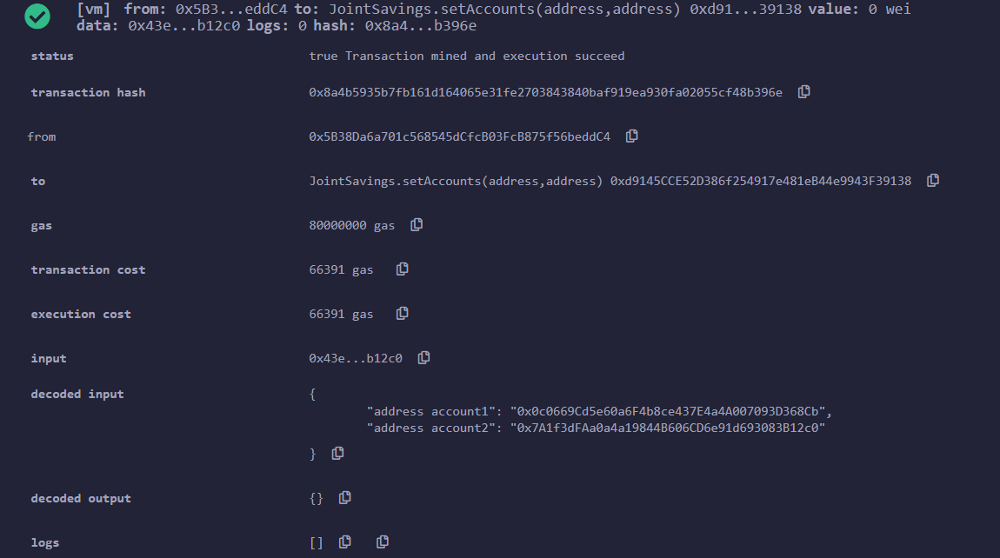
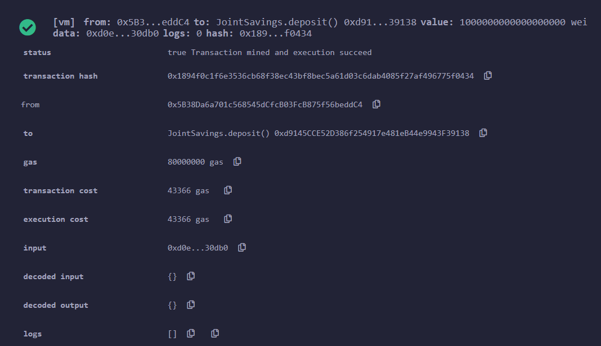
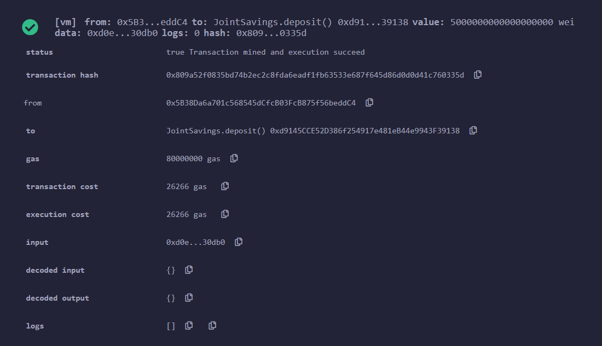
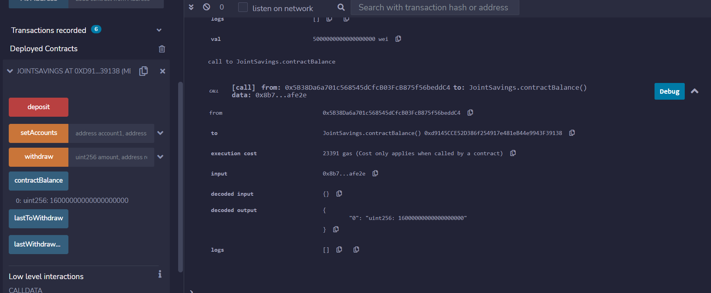
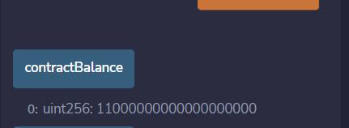
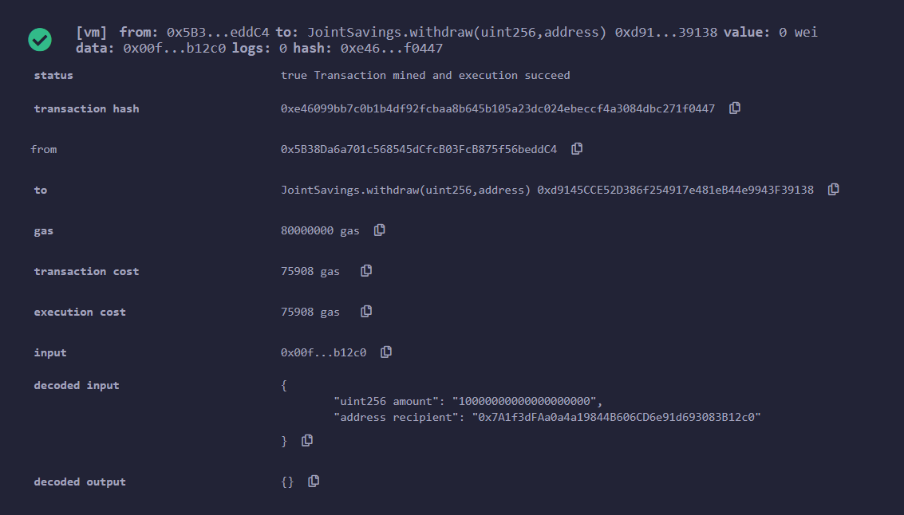
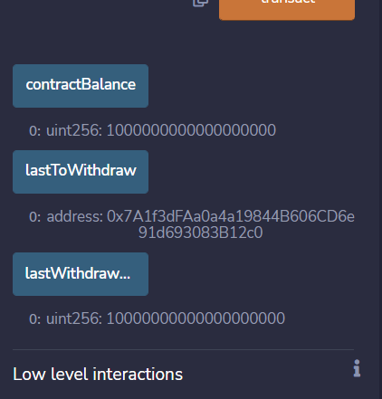

# Smart-Contracts-with-Solidity
### By Nedal Mahanweh

` Files `

[joint_saving_contract](joint_savings.sol) 

[Execution_Results](Execution_Results)

---

The steps for the this Project divided into the following sections:
1. Create a Joint Savings Account Contract in Solidity

2. Compile and Deploy Your Contract in the JavaScript VM

3. Interact with Your Deployed Smart Contract

--------
#### Step 1: Create a Joint Savings Account Contract in Solidity
1. Define a new contract named `JointSavings`.

2. Define the following variables in the new contract:

    * Two variables of type `address payable` named `accountOne` and `accountTwo`

    * A variable of type `address public` named `lastToWithdraw`

    * Two variables of type `uint public` named `lastWithdrawAmount` and `contractBalance

    
4. Define a function named `withdraw` that accepts two arguments: `amount` of type `uint` and `recipient` of type `payable address`. In this function, code the following:

    * Define a `require` statement that checks if `recipient` is equal to either `accountOne` or `accountTwo`. If it isn’t, the `require` statement returns the “You don't own this account!” text.

    * Define a `require` statement that checks if `balance` is sufficient for accomplishing the withdrawal operation. If there are insufficient funds, it returns the “Insufficient funds!” text.

    * Add an `if` statement to check if `lastToWithdraw` is not equal (`!=`) to `recipient`. If it’s not equal, set it to the current value of `recipient`.

    * Call the `transfer` function of the `recipient`, and pass it the `amount` to transfer as an argument.

    * Set `lastWithdrawAmount` equal to `amount`.

    * Set the `contractBalance` variable equal to the balance of the contract by using `address(this).balance` to reflect the new balance of the contract.

5. Define a `public payable` function named `deposit`that coding  the following:

    * Set the `contractBalance` variable equal to the balance of the contract by using `address(this).balance`.

6. Define a `public` function named `setAccounts` that takes two `address payable` arguments, named `account1` and `account2`. In the body of the function, set the values of `accountOne` and `accountTwo` to `account1` and `account2`, respectively.

7. Add a fallback function so that the contract can store ether that’s sent from outside the deposit function.

-----
#### Step 3: Interact with the Deployed Smart Contract

Deploying the the  Smart Contract 

#### Use the `setAccounts` function to define the authorized Ethereum address that will be able to withdraw funds from the contract.

#### Test the deposit functionality of the smart contract by sending the following amounts of ether

* Transaction 1: Send 1 ether as wei

* Transaction 2: Send 10 ether as wei.

* Transaction 3: Send 5 ether

#### Show the accoun Balance after completing the deposit 

##### Test the contract’s withdrawal functionality by withdrawing the following 

* 5 ether into `accountOne` , Display Account Balance 

* 10 ether into `accountTwo`., Display Account Balance 

* Use the `lastToWithdraw` and `lastWithdrawAmount` functions to verify that the address and amount were correct after the last Withdraw transaction 

